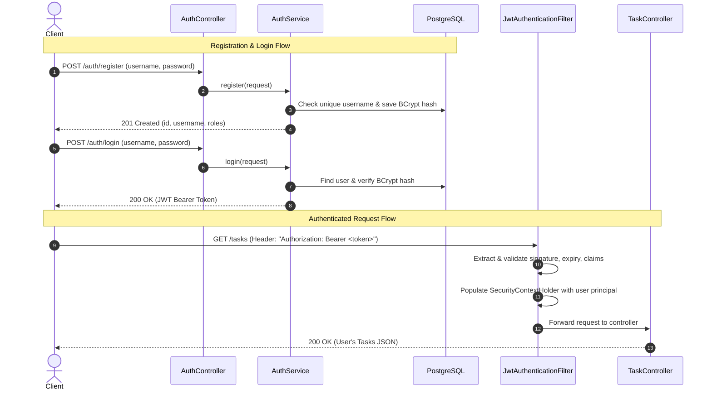

# Task Management API

A production-grade, secure RESTful API built with **Spring Boot 3**, **Spring Security 6**, **Spring Data JPA**, and **PostgreSQL**.

This project provides complete task lifecycle management featuring DTO-based data isolation, Jakarta Bean Validation, centralized error handling, stateless JWT authentication, and strict multi-tenant resource ownership.

---

## Table of Contents
- [Tech Stack](#tech-stack)
- [Architecture & Design](#architecture--design)
- [Authentication & Security Flow](#authentication--security-flow)
- [Task Ownership & Authorization Model](#task-ownership--authorization-model)
  - [Design Decision: 403 Forbidden vs. 404 Not Found](#design-decision-403-forbidden-vs-404-not-found)
- [System Design Summary (10,000 Users Scale Analysis)](#system-design-summary-10000-users-scale-analysis)
  - [What Breaks First?](#what-breaks-first)
  - [Production Mitigation Strategy](#production-mitigation-strategy)
- [API Endpoints Reference](#api-endpoints-reference)
  - [Authentication Endpoints](#authentication-endpoints)
  - [Task Endpoints](#task-endpoints)
- [Unified Error Response Format](#unified-error-response-format)
- [Getting Started & Local Setup](#getting-started--local-setup)
- [Testing Strategy](#testing-strategy)

---

## Tech Stack
- **Language**: Java 21 (LTS)
- **Framework**: Spring Boot 3.4.3
- **Security**: Spring Security 6 (Stateless JWT, BCrypt password hashing)
- **JWT Library**: JJWT 0.12.6 (`jjwt-api`, `jjwt-impl`, `jjwt-jackson`)
- **Persistence**: Spring Data JPA, Hibernate ORM
- **Database**: PostgreSQL (Production/Dev), H2 In-Memory (Test execution)
- **Validation**: Jakarta Bean Validation (`spring-boot-starter-validation`)
- **Utilities**: Project Lombok
- **Testing**: JUnit 5, Mockito, AssertJ, Spring MockMvc, Spring Security Test

---

## Architecture & Design

The API follows a strict layered architecture to ensure separation of concerns, testability, and maintainability:

```
[ HTTP Client / Frontend ]
          │ (JSON + Bearer JWT)
          ▼
[ Security Filter Chain ]  ───► JwtAuthenticationFilter ──► SecurityContextHolder
          │
          ▼
[ Controller Layer ]       ───► DTO Validation (@Valid)
          │
          ▼
[ Service Layer ]          ───► Business Logic & Task Ownership Enforcement
          │
          ▼
[ Data Access Layer ]      ───► Spring Data JPA Repositories (owner-filtered queries)
          │
          ▼
[ Relational Database ]    ───► PostgreSQL (Tables: users, user_roles, tasks)
```

1. **Controller Layer**: Exposes REST endpoints, validates input DTOs, and returns HTTP response codes.
2. **Service Layer**: Implements business transactions, enforces ownership rules, and interacts with domain entities.
3. **Mapper Layer**: Isolates internal JPA entities from external API contracts using dedicated DTOs (`TaskRequestDto`, `TaskResponseDto`, `UserResponse`).
4. **Exception Handling**: Centralized controller advice (`GlobalExceptionHandler`) capturing domain exceptions, validation errors, and authentication failures into a predictable JSON schema.

---

## Authentication & Security Flow

The application utilizes **Stateless JWT (JSON Web Token)** authentication signed using **HMAC-SHA256**:



### Key Security Policies
- **CSRF & Form Login**: Disabled because the API is stateless and accessed via token-bearing API clients.
- **Session Policy**: `SessionCreationPolicy.STATELESS` — no server-side HTTP session state is stored.
- **Public Endpoints**: `/auth/**` (Registration and Login) are openly accessible.
- **Protected Endpoints**: `/tasks/**` require a valid JWT bearer token. Unauthenticated requests trigger `JwtAuthenticationEntryPoint` returning HTTP 401.

---

## Task Ownership & Authorization Model

Every `Task` entity is linked to its creator via an `@ManyToOne` relationship to the `User` entity (`owner_id` foreign key).

When an authenticated user interacts with `/tasks`:
1. **Creation (`POST /tasks`)**: The task is automatically stamped with the authenticated user as its `owner`.
2. **Listing (`GET /tasks`)**: The database query is filtered by the owner ID (`findAllByOwner`), ensuring users cannot see tasks belonging to other accounts.
3. **Retrieval, Update, Deletion (`GET/PUT/DELETE /tasks/{id}`)**: The system first locates the task by ID. If found, it validates whether `task.getOwner().getId().equals(currentUser.getId())`. If the IDs differ, access is rejected immediately.

### Design Decision: 403 Forbidden vs. 404 Not Found

When User A attempts to access or modify User B's task, should the API return **403 Forbidden** or **404 Not Found**?

- **Why this API returns 403 Forbidden**:
  1. **Accurate HTTP Semantics (RFC 9110)**:
     - `401 Unauthorized`: Client is not authenticated (missing or invalid token).
     - `403 Forbidden`: Client is authenticated, but lacks sufficient permissions for the target resource.
     - `404 Not Found`: The resource does not exist in the system (e.g., ID 9999).
  2. **Auditability & Observability**: Distinguishing between 403 and 404 enables security monitoring systems to track suspicious cross-account probing while separating genuine client bugs (broken links, stale IDs).
  3. **Alternative Perspective (Zero-Knowledge / BOLA Prevention)**: In high-threat environments or public multi-tenant APIs with predictable sequential IDs, some architectures return `404 Not Found` to avoid leaking the existence of another user's records. In this application, combining 403 with future UUID-based resource identifiers provides both clear semantics and enumeration resilience.

---

## System Design Summary (10,000 Users Scale Analysis)

Even for a focused service, analyzing scale bottlenecks highlights real-world production readiness.

### What Breaks First?

If this service experiences an influx of **10,000 active concurrent users**, the following bottlenecks will trigger sequentially:

```
[ 10,000 Concurrent Users ]
           │
           ▼
[ 1. BCrypt CPU Saturation ] ──► Login throughput collapses; high CPU utilization
           │
           ▼
[ 2. Database Connection Pool Exhaustion ] ──► HikariCP pool (default: 10) starves; threads block
           │
           ▼
[ 3. Unindexed Foreign Key Sequential Scans ] ──► High disk I/O on `tasks.owner_id`
           │
           ▼
[ 4. Memory & Garbage Collection Pressure ] ──► JVM heap exhausted by unbounded `findAll()`
```

#### 1. Database Connection Pool Exhaustion (HikariCP)
- **The Bottleneck**: By default, Spring Boot configures a HikariCP pool size of 10 connections. 10,000 concurrent requests attempting database reads/writes will immediately exhaust the pool, causing request threads to wait until timing out (`ConnectionTimeoutException`).
- **Remedy**:
  - Size HikariCP pool based on hardware (`pool_size = (core_count * 2) + effective_spindle_count`).
  - Introduce connection pooling proxies like **PgBouncer** in front of PostgreSQL to handle thousands of idle/active client connections efficiently.
  - Deploy read replicas and configure Spring Data with read/write routing data sources.

#### 2. CPU Saturation from Password Hashing (BCrypt)
- **The Bottleneck**: BCrypt uses an intentional work factor (default strength: 10 rounds). While critical for offline dictionary attack protection, hashing takes ~50–100ms of dedicated CPU time per call. If 1,000 users attempt to log in simultaneously during peak hours, CPU cores will run at 100% saturation, starving task queries.
- **Remedy**:
  - Implement rate limiting (e.g., Bucket4j or Redis rate limiter) on `/auth/login`.
  - Isolate authentication into a standalone Auth microservice or serverless worker pool so login spikes do not impact task processing.

#### 3. Unindexed Foreign Key & Sequential Scans
- **The Bottleneck**: `findAllByOwner` searches the `tasks` table by `owner_id`. Without an explicit database index on `tasks(owner_id)`, PostgreSQL executes a full sequential table scan for every request. With 10,000 users having tens of thousands of tasks, query latency degrades from milliseconds to seconds.
- **Remedy**:
  - Add composite index: `CREATE INDEX idx_tasks_owner_created ON tasks(owner_id, created_at DESC);`
  - Enforce pagination (`Pageable` with `limit`/`offset` or keyset pagination) on `GET /tasks` to prevent loading unbounded result sets into JVM memory.

#### 4. Stateless JWT Invalidation & Revocation Gap
- **The Bottleneck**: Because JWTs are stateless and self-contained, if a user's token is compromised or their password is changed, the server cannot invalidate the token until its expiration timestamp elapses.
- **Remedy**:
  - Use short-lived access tokens (e.g., 15 minutes) coupled with refresh token rotation stored in Redis.
  - Maintain a Redis-backed distributed blacklist for revoked tokens checked during filter execution.

---

## API Endpoints Reference

### Authentication Endpoints

| Method | Endpoint | Access | Request Body | Status Codes | Description |
|:---|:---|:---|:---|:---|:---|
| `POST` | `/auth/register` | Public | JSON (`username`, `password`, `roles`) | `201`, `400`, `409` | Registers a new user with BCrypt password hashing |
| `POST` | `/auth/login` | Public | JSON (`username`, `password`) | `200`, `400`, `401` | Authenticates credentials and returns a Bearer JWT |

#### Example: Register User
```bash
curl -X POST http://localhost:8080/auth/register \
  -H "Content-Type: application/json" \
  -d '{
    "username": "alex",
    "password": "SecurePassword123!"
  }'
```

#### Example: Login
```bash
curl -X POST http://localhost:8080/auth/login \
  -H "Content-Type: application/json" \
  -d '{
    "username": "alex",
    "password": "SecurePassword123!"
  }'
```
**Response (200 OK)**:
```json
{
  "token": "eyJhbGciOiJIUzI1NiJ9...",
  "type": "Bearer",
  "username": "alex"
}
```

---

### Task Endpoints

*All task endpoints require the header `Authorization: Bearer <token>`.*

| Method | Endpoint | Access | Request Body | Status Codes | Description |
|:---|:---|:---|:---|:---|:---|
| `POST` | `/tasks` | Authenticated | JSON (`title`, `description`, `status`, `dueDate`) | `201`, `400`, `401` | Creates a task assigned to authenticated user |
| `GET` | `/tasks` | Authenticated | None | `200`, `401` | Returns all tasks owned by authenticated user |
| `GET` | `/tasks/{id}` | Authenticated | None | `200`, `401`, `403`, `404` | Retrieves single task if owned by user |
| `PUT` | `/tasks/{id}` | Authenticated | JSON (`title`, `description`, `status`, `dueDate`) | `200`, `400`, `401`, `403`, `404` | Updates task if owned by user |
| `DELETE` | `/tasks/{id}` | Authenticated | None | `204`, `401`, `403`, `404` | Deletes task if owned by user |

#### Example: Create Task
```bash
curl -X POST http://localhost:8080/tasks \
  -H "Authorization: Bearer <YOUR_JWT_TOKEN>" \
  -H "Content-Type: application/json" \
  -d '{
    "title": "Complete System Architecture Documentation",
    "description": "Include security review and scalability bottlenecks",
    "status": "IN_PROGRESS",
    "dueDate": "2026-12-31T18:00:00Z"
  }'
```

---

## Unified Error Response Format

All error responses across controllers and security filters follow a unified JSON contract:

```json
{
  "timestamp": "2026-09-30T18:18:05.123Z",
  "status": 403,
  "error": "Forbidden",
  "message": "You do not have permission to access or modify this task",
  "path": "/tasks/42"
}
```

### Validation Error Body (`400 Bad Request`)
```json
{
  "timestamp": "2026-09-30T18:18:05.123Z",
  "status": 400,
  "error": "Bad Request",
  "message": "Validation failed",
  "path": "/tasks",
  "validationErrors": {
    "title": "Title cannot be blank",
    "dueDate": "Due date must be today or in the future"
  }
}
```

---

## Getting Started & Local Setup

### Prerequisites
- **Java 21** or higher
- **PostgreSQL 15+** (or Docker)
- **Maven 3.9+** (or use included `./mvnw`)

### 1. Database Setup
Create a PostgreSQL database:
```sql
CREATE DATABASE taskdb;
```

### 2. Configure Environment Variables
In `src/main/resources/application.yml` or via environment variables:
```bash
export SPRING_DATASOURCE_URL=jdbc:postgresql://localhost:5432/taskdb
export SPRING_DATASOURCE_USERNAME=postgres
export SPRING_DATASOURCE_PASSWORD=postgres
export JWT_SECRET=404E635266556A586E3272357538782F413F4428472B4B6250645367566B5970
```

### 3. Run the Application
```bash
./mvnw spring-boot:run
```
The API starts on port `8080`.

---

## Testing Strategy

The test suite covers unit, slice, and full end-to-end integration scenarios:

| Test Class | Focus Area | Framework / Annotations |
|:---|:---|:---|
| `TaskOwnershipIntegrationTest` | Unauthenticated 401 rejection, cross-user 403 rejection, owner-based filtering | `@SpringBootTest`, `@AutoConfigureMockMvc` |
| `AuthControllerIntegrationTest` | Registration (201 & 409 conflict), password BCrypt verification, login (200 & 401) | `@SpringBootTest`, `@AutoConfigureMockMvc` |
| `TaskIntegrationTest` | Full CRUD lifecycle with authenticated JWT headers | `@SpringBootTest`, `@AutoConfigureMockMvc` |
| `TaskControllerTest` | Controller validation, slice testing, HTTP status codes | `@WebMvcTest` |
| `TaskServiceTest` | Service layer business logic and mapping | Mockito (`@ExtendWith(MockitoExtension.class)`) |
| `TaskRepositoryTest` | Persistence queries and JPA mappings | `@DataJpaTest` |

### Execute All Tests
```bash
./mvnw test
```
**Results**: `Tests run: 44, Failures: 0, Errors: 0, Skipped: 0 (BUILD SUCCESS)`
